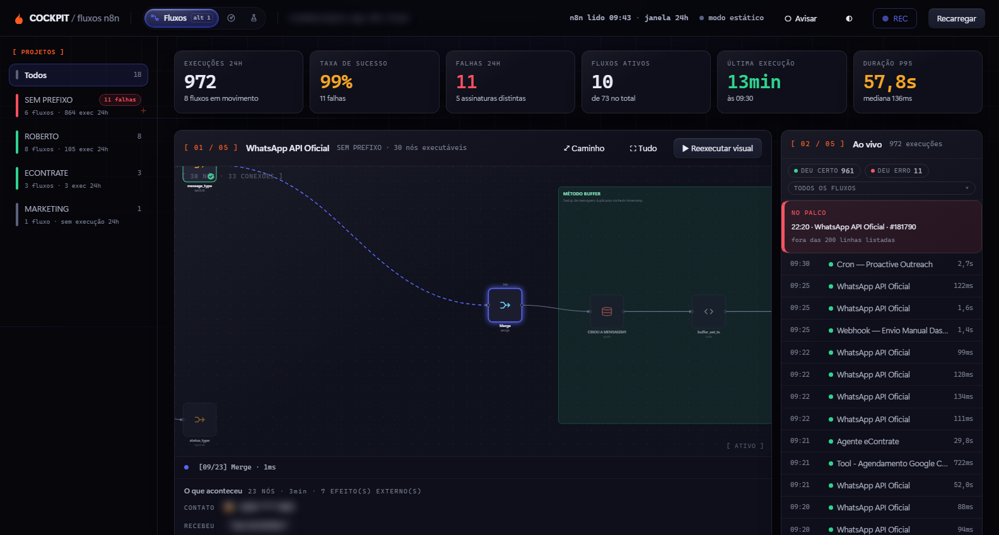
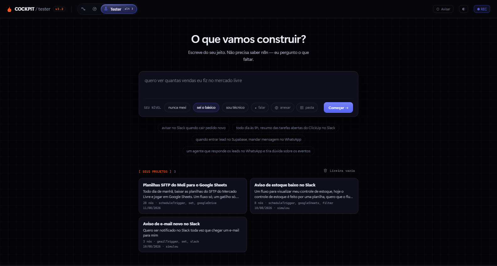

# Cockpit

Painel local para os fluxos n8n da Ecommerce Puro. Ele responde três perguntas que o
editor do n8n não responde: **o que está rodando, o que quebrou e onde — e como construir
o próximo.**

Roda em `127.0.0.1`, com Node 22 e **zero dependências**. A chave da API nunca sai da
máquina.



---

## As três portas

| Porta | Rota | O que ela responde |
|---|---|---|
| **Fluxos** | `/` | O que rodou nas últimas 24h, o que falhou e em qual nó — com replay da execução sobre o grafo real do fluxo. |
| **Tester** | `/tester` | "Como construo o fluxo que está na minha cabeça?" Você descreve em português; ele entrevista, desenha, valida e devolve o JSON. |
| **Disco** | `/disco` | A varredura em disco de todos os projetos: o que está vivo e o que está apodrecendo. |

### Fluxos — do erro até o diff

O quadro agrupa as falhas por assinatura (`fluxo · nó · tipo de erro`). Cada uma pode ser
marcada como corrigida com uma nota do que foi mexido — e **volta sozinha** se o mesmo
erro acontecer de novo, comparado por id de execução, nunca por relógio.

**"⧉ Mandar pro Claude"** não para na área de transferência: o cockpit relê o fluxo e a
execução que falhou, roda o **Claude Code CLI local** em modo headless sobre o fluxo com
defeito, e o que chega na tela é uma **revisão de pull request** — os veredictos dos
portões determinísticos, o diagnóstico, e o diff nó a nó. Se um portão reprova, a mensagem
dele volta para o Claude e ele tenta de novo, até 4 rodadas. **Uma proposta que nunca passa
nunca vira botão.**

O único clique deste repositório que escreve num fluxo de verdade é o **"✓ Aprovar e
aplicar"** — e ele escreve exatamente o diff que estava na tela, com backup antes e
**↺ Desfazer** depois.

### Tester — de uma frase até o JSON



Sete etapas, parando em dois lugares: depois de entender (confirmar a intenção é o
checkpoint mais barato que existe) e no **fantasma** — a simulação do que o fluxo enviaria,
desenhada na anatomia do destino: uma bolha do Slack, uma bolha do WhatsApp, uma linha de
tabela.

O fantasma é **derivado, nunca narrado**: `simulate.js` resolve as próprias expressões do
fluxo contra uma entrada semeada, sem `eval`. Fora do subconjunto que ele sabe avaliar, ele
**recusa em voz alta** em vez de desenhar meio quadro.

Medido em construções reais: um fluxo de notificação sai por **~US$1 em ~3 minutos**; um
agente conversacional de 65 nós, por **US$3,19 em 13,6 minutos** — portões passando na
primeira rodada nos dois casos.

---

## Rodar

Duplo clique em **`start-cockpit.cmd`**. Ou:

```bash
node server.js          # http://localhost:4317
```

O `.env` é obrigatório para o painel de fluxos (fica fora do git, nunca comite):

```ini
N8N_BASE_URL=https://sua-instancia.app.n8n.cloud
N8N_API_KEY=<chave da API pública>

# opcionais — correção pelo Claude
CLAUDE_BIN=C:\Users\...\.local\bin\claude.exe   # só se não estiver no lugar padrão
COCKPIT_CLAUDE_MODEL=sonnet                     # padrão: o modelo padrão do CLI
COCKPIT_SANDBOX_TEST=1                          # teste numa cópia inativa (padrão: off)
```

Sem ele o servidor sobe do mesmo jeito, `/disco` funciona e o painel de fluxos mostra um
estado de erro honesto. Sem o Claude CLI, a correção degrada para a cópia manual do
briefing — **e diz por quê**, nunca finge que uma sessão rodou.

> **Não suba o servidor como tarefa de fundo do Claude Code.** Esses processos morrem quando
> o harness os recolhe, e o cockpit cai no meio da sessão.

### O portão de parâmetro precisa de dois comandos por checkout

O esquema dos nós vem dos pacotes npm do n8n e é estado por checkout, fora do git. Um clone
novo não tem nenhum dos dois, e o Tester simplesmente roda sem esse portão:

```bash
node esquema.js --baixar      # minutos: ~26 mil arquivos para descompactar
node esquema.js --construir
```

## Testes

```bash
testar.cmd            # duplo clique: as 16 baterias que não custam nada
```

Nenhum deles chama modelo nem gasta cota. `tester-smoke.js` fica de fora de propósito —
esse conduz uma construção inteira e cobra do plano.

---

## O invariante central

**`server.js` e `n8n.js` afirmam fatos. O HTML julga.** O servidor nunca decide que um
projeto ou um fluxo está doente, parado ou arriscado: ele reporta contagens, carimbos de
tempo, saída do git, status de execução e mensagens de erro. Toda banda, agrupamento e
frase de diagnóstico mora num bloco de julgamento marcado no topo do script da página.

É por isso que a definição de "saudável" — a parte que mais muda — não exige reiniciar nada.

**O segundo invariante: o que vem do n8n é hostil.** A API traz coisas que não podem chegar
ao navegador nem a um arquivo de cache: id e nome de credencial, chaves de sessão montadas
com telefone do lead, e o payload inteiro da execução, que aqui é conversa real de cliente.
Toda resposta passa por uma lista branca explícita — **campo que não está nomeada lá não
existe daqui para a frente.**

## O que ele não faz, de propósito

- **Não altera código de projeto e não faz deploy.** A única escrita é um diff de fluxo
  aprovado a clique, mais uma cópia `[SANDBOX]` inativa e sem credencial.
- **Não executa fluxo.** A API pública do n8n não tem endpoint de execução — não é escolha
  de escopo.
- **Não anexa credencial que exija escolha.** Quando existe uma única candidata sem
  ambiguidade, o JSON exportado já sai ligado; com duas, ele pergunta em vez de chutar.
- **Não guarda segredo.** Criar credencial continua sendo no n8n, e 7 dos 16 tipos usados
  nesta conta são OAuth, que não se resolve colando um valor.

---

## Mapa

| Arquivo | Papel |
|---|---|
| `server.js` | Servidor HTTP local, varredura de disco, SSE. **Só fatos.** |
| `n8n.js` | Cliente da API do n8n. **Fronteira de segurança.** |
| `flows.html` · `cockpit.html` · `tester.html` | As três telas. **Todo o julgamento vive nelas.** |
| `claude-fix.js` | Roda o Claude CLI headless, aplica o patch, roda os portões, monta o diff. |
| `tester.js` · `simulate.js` · `agentes.js` | A máquina de etapas do Tester, o fantasma e o que só vale para agente. |
| `esquema.js` | A definição autoritativa dos nós, destilada dos pacotes npm: 810 tipos, com enum, default e aplicabilidade por versão. |
| `catalog.js` | O que esta instância aceita de verdade, destilado dos fluxos vivos. **Nenhum valor de parâmetro vai para o disco.** |
| `licoes.js` | A base que aprende com a rodada reprovada, a edição aceita e o erro em produção. |
| `novidades.js` | O changelog do n8n, lido uma vez por dia, com portões e sem retry. |
| `anexos.js` · `aba.js` | Anexos e ditado; o aviso que chega quando ninguém está olhando. |
| `n8n-gramatica.md` · `tester-agentes.md` | O conhecimento em prosa, lido em tempo de execução. Editar muda o que o Tester constrói — sem mexer em código. |
| `preview/gen-*.js` | Geradores de preview. O CSS é **extraído** da página, nunca copiado — um preview não pode divergir da tela. |
| `docs/n8n-kb/` | A cópia portátil da base de n8n, já em formato de skill do Claude Code. |

## Documentos

- **`CLAUDE.md`** — a memória do projeto: cada decisão, cada armadilha medida e o motivo de
  cada invariante. É o arquivo para ler antes de mexer em qualquer coisa.
- **`PLAN.md`** e **`PLAN-REVIEW-LOG.md`** — o desenho do Tester e as cinco rodadas de
  revisão adversarial que o endureceram.
- **`00-research.md`** — a pesquisa que produziu as regras de layout.
- **`PLAN-CONHECIMENTO.md`** — por que o catálogo não bastava e o que o esquema resolveu.
